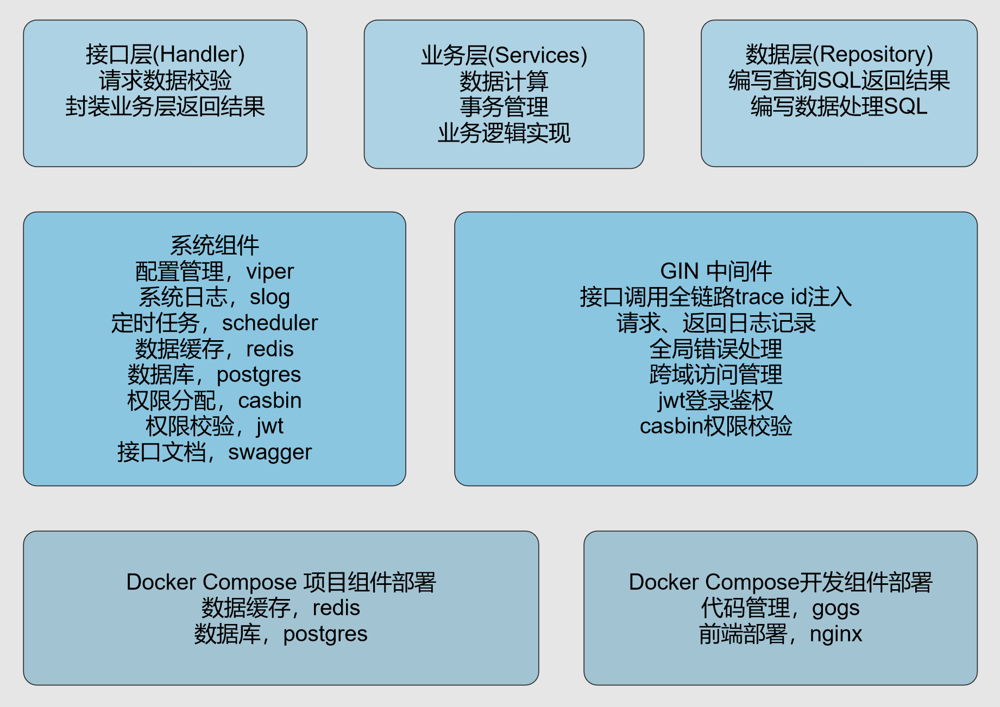
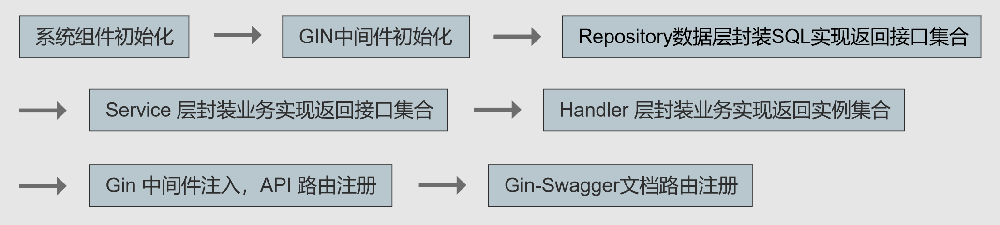
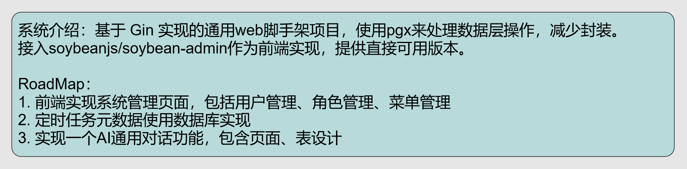

# Leoture-Web 基于 GIN 实现的通用脚手架项目

## 详细文档
面向生产环境的GoWeb通用架构项目，基于Gin框架构建，整合了JWT + Casbin权限控制、PostgreSQL (PGX) 数据持久化、Redis缓存、Viper配置热更新、robfig/cron定时任务、gin-swagger API文档以及slog结构化日志等主流组件。项目采用领域驱动的分层架构，按业务域划分handler、service、repository、model、types层级，通过接口集合与构造函数依赖注入管理同层依赖，形成清晰的依赖链。内置CORS、错误处理、链路追踪、日志等中间件，提供标准化请求处理、统一错误响应与生产级可观测性，旨在为业务系统提供可扩展、易维护的后端开发骨架，帮助团队快速启动新项目并聚焦业务逻辑实现。

## 项目架构图

## 项目目录结构
| 目录 | 描述 |
| --- | --- |
| bruno_api_test | API 测试用例 |
| cmd | 程序运行入口 |
| config | 系统配置、跨域配置、定时任务配置、数据库配置、缓存配置、jwt和casbin配置、swagger文档配置 |
| deploy | 外部依赖组件部署资源，包括gogs和nginx |
| docs | 项目文档资源 |
| migrations | 项目迁移重新部署资源 |
| internal/authorization | jwt、casbin核心实现 |
| internal/cache | Redis 初始化 |
| internal/config | Viper 配置管理初始化 |
| internal/database | Postgres 初始化 |
| internal/errors | 全局错误码、内容定义 |
| internal/handler | 接口层 |
| internal/logger | Slog 日志管理初始化 |
| internal/middleware | gin中间件，包括casbin、cors、error、jwt、log、requestTrace |
| internal/model | 领域模型数据结构，与数据库表强一致性 |
| internal/repository | 数据库处理层，SQL 在此处集中编写 |
| internal/router | Gin路由注册 |
| internal/scheduler | 定时任务业务逻辑与注册 |
| internal/service | 领域业务逻辑代码 |
| internal/types | DTO定义、公共数据结构 |
| internal/utils | 系统通用工具 |
| internal/migrations | 数据库迁移脚本 |

## Road Map

